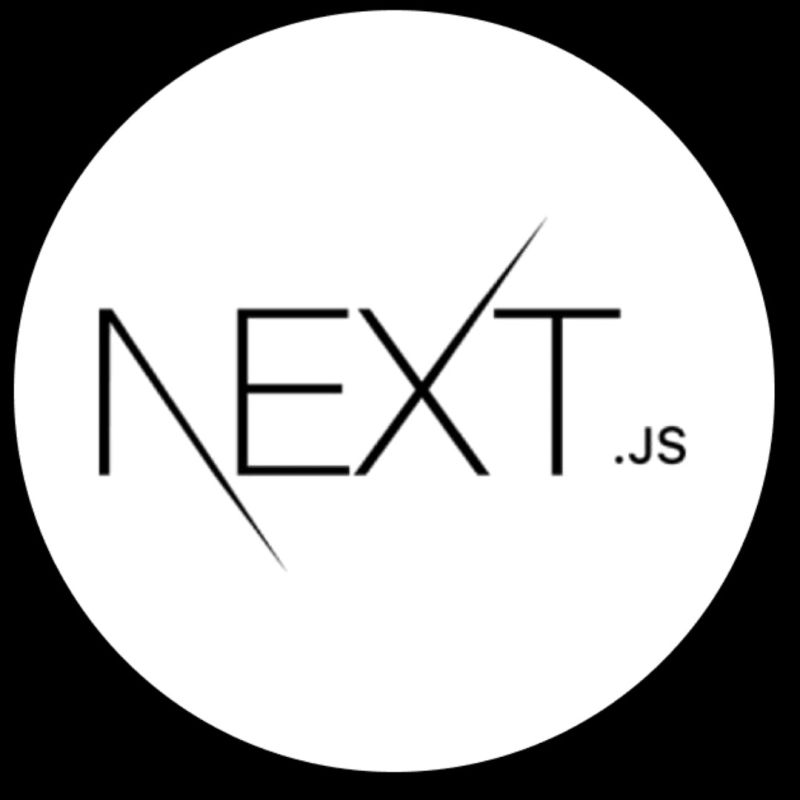
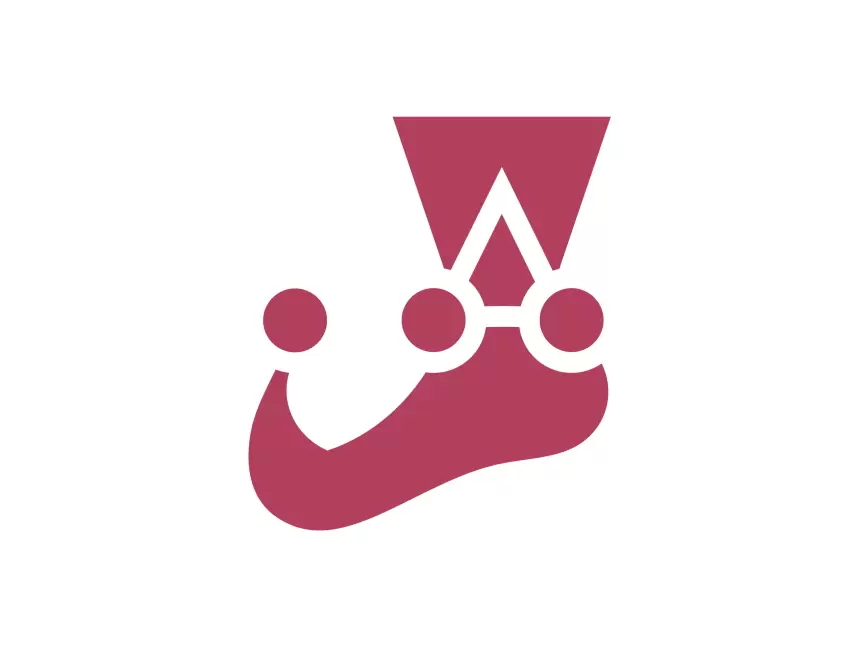

# Hello Everyone 😁

Eu sou o Kaaz, um estudante de programação pela escola Trybe. Sou apaixonado por tecnologia e dedico-me diariamente a mergulhar no mundo da programação, buscando constantemente meu desenvolvimento e capacitação para entregar valor às pessoas. Tenho um imenso prazer em ajudar os outros a crescerem e se desenvolverem. Se estiver interessado em bater um papo, não hesite em entrar em contato comigo pelo LinkedIn ou Twitter. Estou sempre disponível para trocar ideias e conhecimentos.

 

## Minhas paixões na vida:

- ⛵ Sou apaixonado por esportes à vela. Sempre que tenho um tempo livre e o vento está soprando, reúno-me com meus amigos e vou velejar de kitesurf em alguma lagoa próxima.

- 🏃🏻 Quando não há vento, gosto de praticar corrida ou fazer caminhadas em meio à natureza, desconectando um pouco das telas e focando no momento presente.

- 🎮 Sou um entusiasta de videogames, principalmente jogos de estratégia, puzzles lógicos e jogos indie em geral.

- 👨🏻‍💻 No momento, meu foco principal é o desenvolvimento backend. À medida que me aprofundo, fico maravilhado e entusiasmado com as possibilidades. Trabalho principalmente com **Node.js** e seu framework mais famoso, o **Express**. Meu objetivo principal é aplicar e aprofundar meus conhecimentos em arquiteturas como **SOLID** e **DDD**.

- 💻 No desenvolvimento frontend, costumo utilizar o ecossistema do **React**. Gosto especialmente de criar aplicações com componentes bem estruturados e tenho grande prazer em escrever testes.
  
 

## Tecnologias favoritas ❤️

 

## Github Stats

